 

[English](#english) • [Русский](#russian) • [Українська](#ukrainian)

## English

I build AI-native products, LLM workflows, and developer-facing systems with a focus on execution, usability, and product quality.

### Focus

- AI products with real interfaces, not just demos
- LLM gateways, orchestration, automation, and internal tools
- Developer tooling, admin panels, and system-heavy applications
- Product engineering with attention to UX, speed, and reliability

### Featured Projects

| Project | What it is |
| --- | --- |
| [`agent-debate-documentation`](https://github.com/xoxma1993/agent-debate-documentation) | Dual-agent LLM discussion engine with a streaming Next.js interface and markdown export |
| [`ServerDock`](https://github.com/xoxma1993/ServerDock) | Web-based server setup and management panel |
| [`OmniRoute`](https://github.com/xoxma1993/OmniRoute) | AI gateway for multi-provider LLM routing, fallbacks, retries, and observability |
| [`ScreenCoder`](https://github.com/xoxma1993/ScreenCoder) | UI-to-code workflow focused on turning screenshots into editable frontend output |

### Stack

  
  
  
  
  
  
  
  
  
  

### Highlights

- Shipping practical AI experiences instead of toy experiments
- Strong bias toward systems that are operable, scalable, and clear to use
- Interested in premium product quality, automation, interfaces, and execution speed

### GitHub Snapshot

  
  

  

### Connect

- GitHub: [@xoxma1993](https://github.com/xoxma1993)
- Work and experiments: open source repositories below this profile

---

## Русский

Я создаю AI-продукты, LLM-системы, автоматизацию и developer tools с упором на качество интерфейсов, практическую пользу и скорость запуска.

### Основной фокус

- AI-продукты с реальным пользовательским сценарием
- LLM orchestration, gateway-слой и внутренние инструменты
- Системные веб-приложения, админки и automation-процессы
- Продуктовый подход: чтобы решение было не только рабочим, но и сильным визуально

---

## Українська

Я створюю AI-продукти, LLM-системи, автоматизацію та developer tools з фокусом на якість інтерфейсів, практичну користь і швидкий запуск.

### Основний фокус

- AI-продукти з реальним сценарієм використання
- LLM orchestration, gateway-рівень та внутрішні інструменти
- Системні вебзастосунки, адмін-панелі та automation-процеси
- Продуктовий підхід: рішення має бути не лише робочим, а й сильним візуально

---

  Built for a premium GitHub profile presence with lightweight animation and clean multilingual structure.

